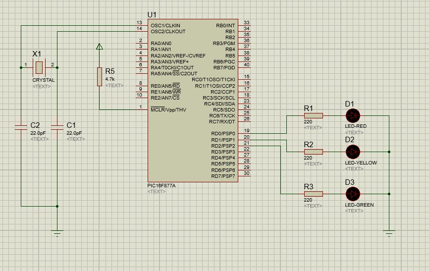
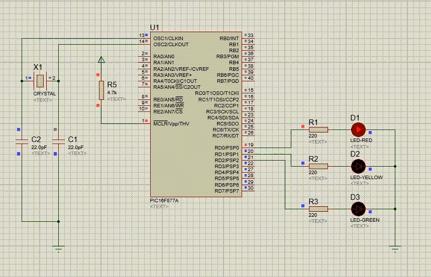
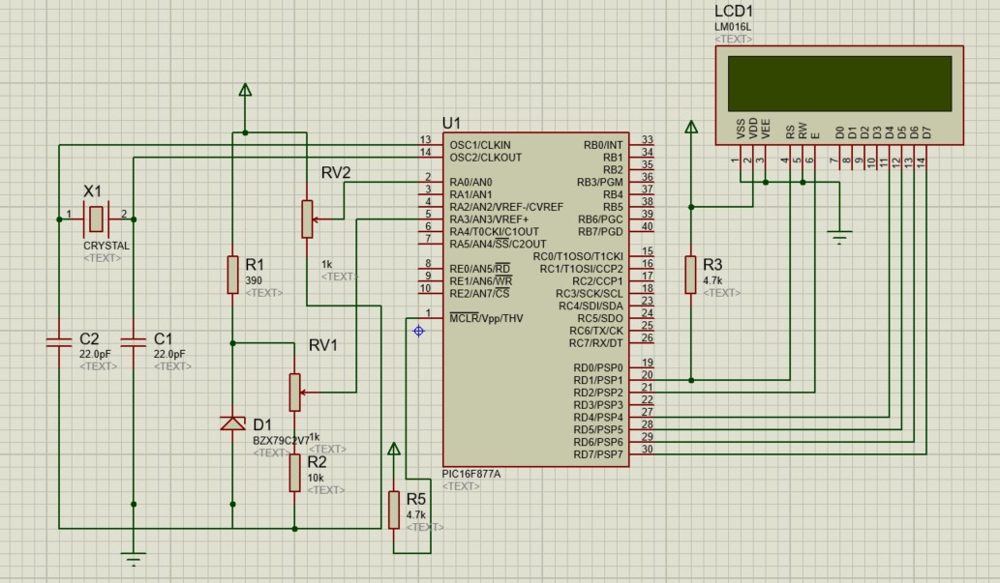
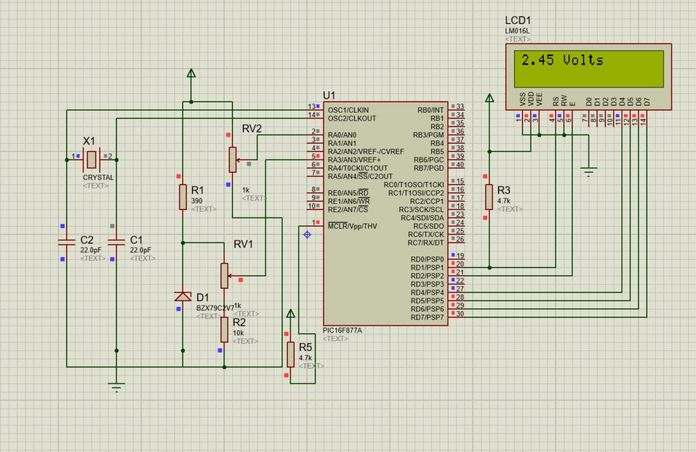
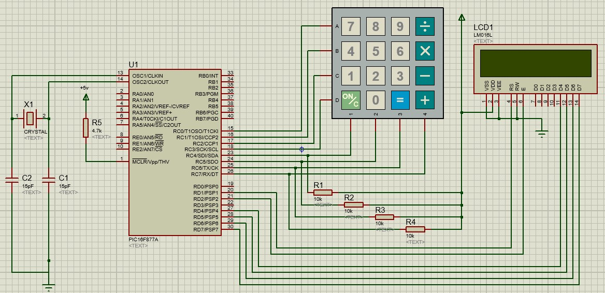
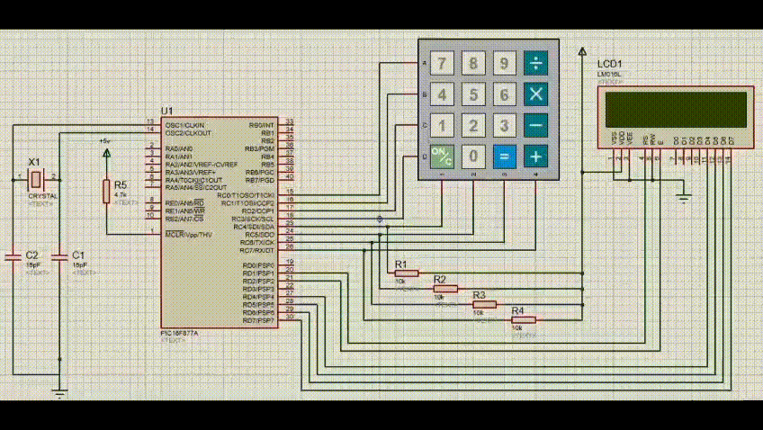

# PIC16F877A Sample Circuits Repository

Welcome to the **PIC16F877A Sample Circuits Repository**! This repository provides a collection of sample circuits and example codes written in **Assembly** to enthusiasts get started with the **PIC16F877A microcontroller**. if you are a beginner exploring microcontroller programming, this repository aims to be a valuable resource for you.

---

## Table of Contents
* [Base Circuit: Connecting the Oscillator](#base-circuit-connecting-the-oscillator)
  > This example demonstrates how to connect an oscillator to the PIC16F877A microcontroller, ensuring stable clock operation for your projects.

* [3-Leds Blinking: Blinking 3 LEDs](#3-leds-blinking-blinking-3-leds)
  > This example demonstrates how to blink 3 LEDs using the PIC16F877A microcontroller. The program turns on and off the LEDs in a sequence with a delay of 2 seconds between each transition.

* [7-Segment Display: Counting from 0 to 9](#7-segment-display-counting-from-0-to-9)
  > This example demonstrates interfacing a 7-segment display with the PIC16F877A microcontroller. The program loops through numbers 0 to 9 with approximately a 1-second delay between each count.

* [ADC - LCD: Displaying Analog Voltage on LCD](#adc---lcd-displaying-analog-voltage-on-lcd)
  > This example demonstrates how to display an analog voltage on an LCD using the PIC16F877A microcontroller. The program reads an analog voltage from the ADC and displays it on the LCD in real-time.

* [Simple Calculator: Basic Arithmetic Operations](#simple-calculator-basic-arithmetic-operations)
  > This example demonstrates how to create a simple calculator using the PIC16F877A microcontroller. The program allows users to perform basic arithmetic operations such as addition, subtraction, multiplication, and division on two numbers and display the result on an LCD.

---

## Introduction to PIC16F877A

The **PIC16F877A** is a powerful microcontroller developed by Microchip Technology. It is widely used in embedded systems due to its:
- 8-bit architecture
- 40-pin DIP/PDIP packaging
- Rich set of peripherals including ADC, PWM, UART, SPI, and I2C
- 368 bytes of RAM, 256 bytes of EEPROM, and 8K words of program memory

For more technical details, refer to the official [PIC16F877A Datasheet](https://www.microchip.com).

---

## Prerequisites

Before you begin, ensure you have the following:
- A **PIC16F877A** microcontroller and necessary hardware components
- A **PIC Programmer** (e.g., PICkit 3 or 4)
- Installed **MPLAB X IDE**
- Installed **MPASM Assembler** for working with ASM files
- Installed **Proteus** for circuit simulation

### Useful Links
- [MPLAB X IDE Download](https://www.microchip.com/mplab/mplab-x-ide)
- [MPASM Assembler Documentation](https://www.microchip.com/)
- [Proteus Demo Version](https://www.labcenter.com/downloads/)

---

## Base Circuit: Connecting the Oscillator

- **Description**: This example demonstrates how to connect an external oscillator to the PIC16F877A microcontroller. The oscillator provides a stable clock signal to the microcontroller, ensuring accurate timing for your projects.

- **Components**:
  - PIC16F877A Microcontroller
  - Oscillator (e.g., 4MHz)
  - Capacitors (22pF)
  - Power Supply (5V)
  - Breadboard and Connecting Wires

- **Circuit Diagram**:

    

- **Files**:
  - [Proteus File](base/base.pdsprj)
  > The Proteus file contains the PIC16F877A microcontroller with an external oscillator connected to it. The oscillator provides a stable clock signal to the microcontroller.

---

## 3-Leds Blinking: Blinking 3 LEDs
- **Description**: This example demonstrates how to blink 3 LEDs using the PIC16F877A microcontroller. The program turns on and off the LEDs in a sequence with a delay 2sec between each transition.

- **Components**:
  - PIC16F877A Microcontroller
  - 3 LEDs (Red, Yello, Green)
  - Resistors (220 Ohms)
  - Power Supply (5V)
  - Breadboard and Connecting Wires

- **Circuit Diagram**:

    

- **Files**:
  - [Proteus File](led/led.pdsprj)
  > The Proteus file contains the PIC16F877A microcontroller interfaced with 3 LEDs. The program blinks the LEDs in a sequence with a 2-second delay between each transition.

  - [Assembly File](led/led.asm)
  > The assembly file contains the code to blink 3 LEDs in a sequence.

  - [HEX File](led/led.hex)
  > The HEX file is generated from the assembly code and can be loaded into the microcontroller for execution.

- **Demo**:

    

- **Usage**: 
  1. Open the Proteus file in Proteus software.
  2. Load the HEX file into the PIC16F877A microcontroller.
  3. Run the simulation to see the 3 LEDs blinking in a sequence.

---

## 7-Segment Display: Counting from 0 to 9
- **Description**: This example demonstrates interfacing a 7-segment display with the PIC16F877A microcontroller. The program loops through numbers 0 to 9 with approximately a 1-second delay between each count.

- **Components**:
  - PIC16F877A Microcontroller
  - 7-Segment Display
  - Resistors (220 Ohms)
  - Power Supply (5V)
  - Breadboard and Connecting Wires

- **Circuit Diagram**:

    

- **Files**:
  - [Proteus File](7-segment/7_segment.pdsprj)
  > The Proteus file contains the PIC16F877A microcontroller interfaced with a 7-segment display. The program counts from 0 to 9 with a 1-second delay between each count.

  - [Assembly File](7-segment/7_segment.asm)
  > The assembly file contains the code to display numbers 0 to 9 on the 7-segment display.

  - [HEX File](7-segment/7_segment.hex)
  > The HEX file is generated from the assembly code and can be loaded into the microcontroller for execution.

- **Demo**:

    

- **Usage**: 
  1. Open the Proteus file in Proteus software.
  2. Load the HEX file into the PIC16F877A microcontroller.
  3. Run the simulation to see the 7-segment display counting from 0 to 9.

---

## ADC - LCD: Displaying Analog Voltage on LCD
- **Description**: This example demonstrates how to display an analog voltage on an LCD using the PIC16F877A microcontroller. The program reads an analog voltage from the ADC and displays it on the LCD in real-time.

- **Components**:
  - PIC16F877A Microcontroller
  - LCD (16x2)
  - Potentiometer
  - Resistors 
  - Power Supply (5V)
  - Breadboard and Connecting Wires

- **Circuit Diagram**:

    

- **Files**:
  - [Proteus File](ADC-LCD/ADC-LCD.pdsprj)
  > The Proteus file contains the PIC16F877A microcontroller interfaced with an LCD and a potentiometer. The program reads an analog voltage from the potentiometer using the ADC and displays it on the LCD in real-time.

  - [Assembly File](ADC-LCD/main.asm)
  > The assembly file contains the code to read an analog voltage from the potentiometer using the ADC and display it on the LCD.

  - [LCD Functions File](ADC_LCD/LCDIS.inc)
  > The LCD functions file contains the necessary functions to initialize and write data to the LCD.

  - [HEX File](ADC-LCD/ADC-LCD.hex)
  > The HEX file is generated from the assembly code and can be loaded into the microcontroller for execution.

- **Demo**:

    

- **Usage**:
  1. Open the Proteus file in Proteus software.
  2. Load the HEX file into the PIC16F877A microcontroller.
  3. Run the simulation to see the analog voltage displayed on the LCD in real-time.

---

## Simple Calculator: Basic Arithmetic Operations
- **Description**: This example demonstrates how to create a simple calculator using the PIC16F877A microcontroller. The program allows users to perform basic arithmetic operations such as addition, subtraction, multiplication, and division on two numbers and display on an LCD.

- **Components**:
  - PIC16F877A Microcontroller
  - LCD (16x2)
  - Keypad (4x4)
  - Resistors
  - Power Supply (5V)
  
- **Circuit Diagram**:

    

- **Files**:
  - [Proteus File](simple_calc/simple_calc.pdsprj)
  > The Proteus file contains the PIC16F877A microcontroller interfaced with an LCD and a keypad. The program allows users to perform basic arithmetic operations on two numbers and display the result on the LCD.

  - [Assembly File](simple_calc/simple_calc.asm)
  > The assembly file contains the code to create a simple calculator using the PIC16F877A microcontroller.

  - [LCD Functions File](simple_calc/LCDIS_PORTD.inc)
  > The LCD functions file contains the necessary functions to initialize and write data to the LCD.

  - [HEX File](simple_calc/simple_calc.hex)
  > The HEX file is generated from the assembly code and can be loaded into the microcontroller for execution.

- **Demo**:

    

- **Usage**:
  1. Open the Proteus file in Proteus software.
  2. Load the HEX file into the PIC16F877A microcontroller.
  3. Run the simulation to use the simple calculator and perform basic arithmetic operations.

---

## License

This project is licensed under the MIT License. Feel free to use, modify, and distribute the content with proper attribution.

---

