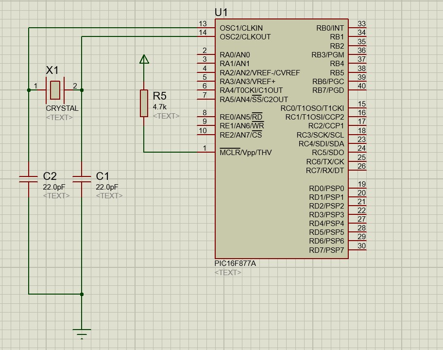
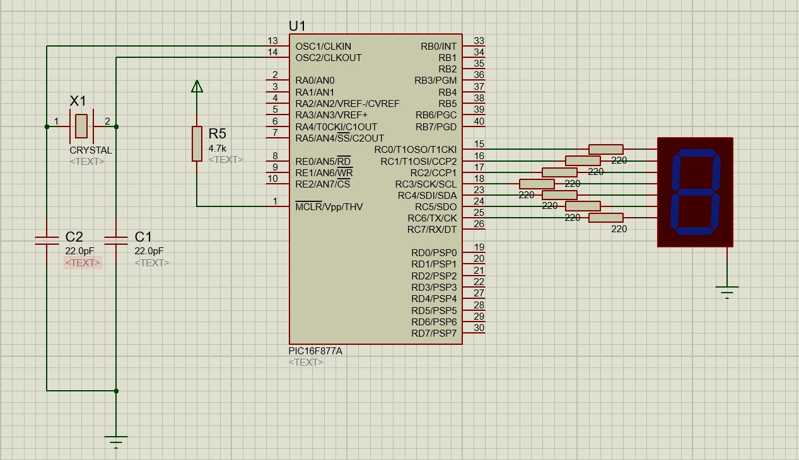
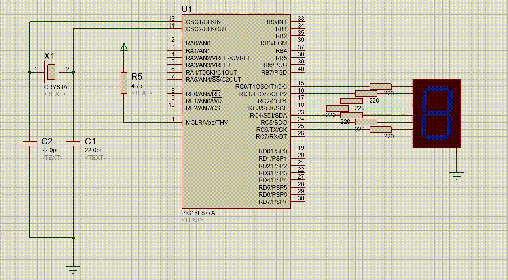

# PIC16F877A Sample Circuits Repository

Welcome to the **PIC16F877A Sample Circuits Repository**! This repository provides a collection of sample circuits and example codes to help developers and enthusiasts get started with the **PIC16F877A microcontroller**. Whether you are a beginner exploring microcontroller programming or an advanced user working on embedded system projects, this repository aims to be a valuable resource for you.

---

## Table of Contents
* [Base Circuit: Connecting the Oscillator](#base-circuit-connecting-the-oscillator)
  > This example demonstrates how to connect an oscillator to the PIC16F877A microcontroller, ensuring stable clock operation for your projects.

* [7-Segment Display: Counting from 0 to 9](#7-segment-display-counting-from-0-to-9)
  > This example demonstrates interfacing a 7-segment display with the PIC16F877A microcontroller. The program loops through numbers 0 to 9 with approximately a 1-second delay between each count.

---

## Introduction to PIC16F877A

The **PIC16F877A** is a powerful microcontroller developed by Microchip Technology. It is widely used in embedded systems due to its:
- 8-bit architecture
- 40-pin DIP/PDIP packaging
- Rich set of peripherals including ADC, PWM, UART, SPI, and I2C
- 368 bytes of RAM, 256 bytes of EEPROM, and 8K words of program memory

For more technical details, refer to the official [PIC16F877A Datasheet](https://www.microchip.com).

---

## Repository Structure

```plaintext
📂 PIC16F877A-Sample-Circuits
├── 📁 base
│   ├── protus_file
│   ├── 📁 assets
│   │   ├── circuit.jpg
│   │   └── other_files
├── 📁 7_segment
│   ├── protues_file
│   ├── asm_file
│   ├── hex_file
│   └── 📁 assets
│       ├── diagram.png
│       ├── demo.mp4
│       └── demo.gif
└── README.md
```

---


## Prerequisites

Before you begin, ensure you have the following:
- A **PIC16F877A** microcontroller and necessary hardware components
- A **PIC Programmer** (e.g., PICkit 3 or 4)
- Installed **MPLAB X IDE**
- Installed **MPASM Assembler** for working with ASM files
- Installed **Proteus** for circuit simulation

### Useful Links
- [MPLAB X IDE Download](https://www.microchip.com/mplab/mplab-x-ide)
- [MPASM Assembler Documentation](https://www.microchip.com/)
- [Proteus Demo Version](https://www.labcenter.com/downloads/)


---


## Base Circuit: Connecting the Oscillator

- **Description**: This example demonstrates how to connect an external oscillator to the PIC16F877A microcontroller. The oscillator provides a stable clock signal to the microcontroller, ensuring accurate timing for your projects.

- **Components**:
  - PIC16F877A Microcontroller
  - Oscillator (e.g., 4MHz)
  - Capacitors (22pF)
  - Power Supply (5V)
  - Breadboard and Connecting Wires

- **Circuit Diagram**:

<div align="center">
    
</div>


- **Files**:
  - [Proteus File](base/protus_file)
  > The Proteus file contains the PIC16F877A microcontroller with an external oscillator connected to it. The oscillator provides a stable clock signal to the microcontroller.

---

## 7-Segment Display: Counting from 0 to 9
- **Description**: This example demonstrates interfacing a 7-segment display with the PIC16F877A microcontroller. The program loops through numbers 0 to 9 with approximately a 1-second delay between each count.

- **Components**:
  - PIC16F877A Microcontroller
  - 7-Segment Display
  - Resistors (220 Ohms)
  - Power Supply (5V)
  - Breadboard and Connecting Wires

- **Circuit Diagram**:

<div align="center">
    
</div>

- **Files**:
  - [Proteus File](7-segment/protues_file)
  > The Proteus file contains the PIC16F877A microcontroller interfaced with a 7-segment display. The program counts from 0 to 9 with a 1-second delay between each count.

  - [Assembly File](7-segment/asm_file)
  > The assembly file contains the code to display numbers 0 to 9 on the 7-segment display.


  - [HEX File](7-segment/hex_file)
  > The HEX file is generated from the assembly code and can be loaded into the microcontroller for execution.

- **Demo**:

<div align="center">
    
</div>


- **Usage**: 
  1. Open the Proteus file in Proteus software.
  2. Load the HEX file into the PIC16F877A microcontroller.
  3. Run the simulation to see the 7-segment display counting from 0 to 9.

---


## Contributing

Contributions are welcome! If you have a circuit or example code to share, please:
1. Fork the repository.
2. Create a new branch: `git checkout -b feature/new-circuit`.
3. Commit your changes: `git commit -m 'Add new circuit example'`.
4. Push to the branch: `git push origin feature/new-circuit`.
5. Open a Pull Request.

---

## License

This project is licensed under the MIT License. Feel free to use, modify, and distribute the content with proper attribution.

---

